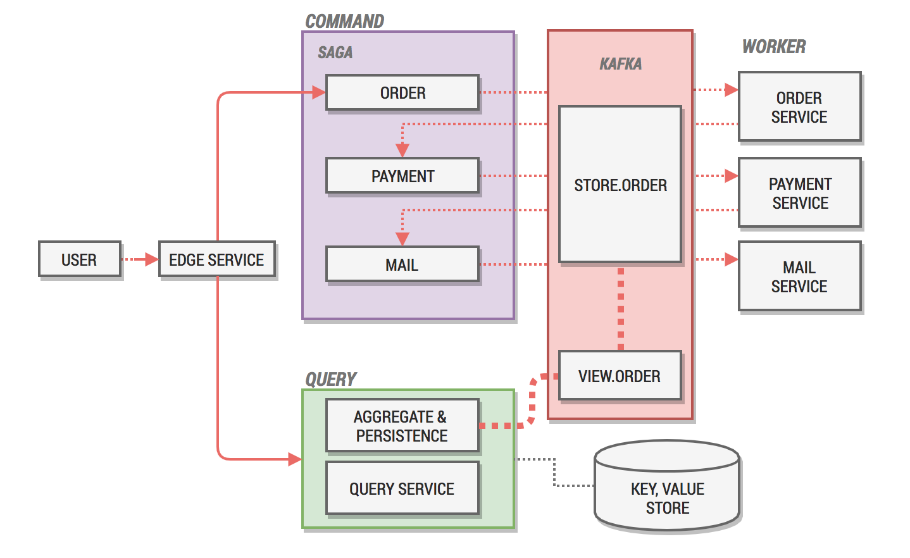

# Simple CQRS Examples

## 간단한 소개

간단하게 CQRS 를 구현하는 예제입니다.

주문 Command 한번에, 주문 상세(Order Detail), 결제(Payment), 메일(Mail) 발송 세가지 업무가 차례대로 진행된다는 흐름입니다. eventsourcing이 나 CQRS에 대한 내용이지만, 그중에서 Kafka Streams 를 사용할때 편하게 Aggregation 이나 Query용 View 를 만드는 방법에 집중했습니다.

전체 흐름은 Command 와 Query 부분으로 나눠서 볼수 있습니다.  (REST API 는 Gateway 역할인 Edge Service 를 통해 제공 됩니다.)



### Command

실제라면 command 에서 매 event 마다 고려해야할 부분이 많겠지만, 이번 예제에서는 단순히 event 를 처리하는 각각의 worker node와, 해당  worker가 처리한 event를 듣고 다음 task를 지시하는 orchestration-based saga 가 있다고 생각했습니다.

- Worker
  - Order, Payment, Mail 세가지의 업무가 순차적으로 일어난다고 가정하였고, 각각의 요청과 처리는 `store.order` 라는 단일 topic 을 통한다고 생각했습니다. 하지만 예제의 구현과 달리 하나의 topic을 통해서만 이벤트가 흘러다녀야 한다고는 생각하지 않고 각각 상황에 맞게 다른 topic에 저장 되어도 상관 없는 구현입니다. 이에 관해서는 모두 하나에 들어가야 한다, entity마다, aggregate별로 event가 쌓여야 한다, 등 여러가지 이견이 있지만, 개인적인 생각은 kafka의 구현이라면 시간순서의 제약 외에는 여러 topic에 쌓이는게 자연스럽지 않을까 합니다.
- Saga
  - Saga는 분산 CUD를 구현할때 사용하는 상태 관리 방법중에 하나로 event 기반으로 transaction 메시지가 전달될때 다음으로 진행시켜야 할지, 보상 transaction 을 시작해야 할지 관리하는 역할이지만 이번 예제에서는 단순히 메시지 전달하는 기능밖에 없습니다. 추후로 보상 이나 Pause, Scheduling, Audit 등 여러가지 상태 관리를 하는 방식으로 더 진행해보고 싶습니다.

### Query

query를 구현하는 방법이 너무 많지만,이번에는 Kafka streams의 Processor API, 그중 Transformer를 사용해봤습니다. Transformer는 직접  Statestore를 데이터 put, get이 자유로워서, 제가 원하는 방식으로 Aggregation 하여 Materialized View 를 위한 topic `view.order`로 밀어 넣었습니다, 별도의 statestore를 조회하는 방식이 아니라, `view.order` 를 consume하여 KV store (여기서는 mongodb)로 따로 보관 하였습니다. local statestore 를 조회하는 방법도 물론 가능하지만 관리나, 배포, HA 구성과 같은 운영적인 부분에서는 차라리 별도의 read 전용 DB를 가져가는게 맞다고 생각하고 있습니다.

Transformer를 사용하는 또 하나의 장점은 만약 여러 Topic을 Aggregate 해야하는 일이 생기더라도 원하는 방식으로 조작하여 원하는 topic( 공통의 조회전용 topic)으로 흘려보내는게  몇줄 코딩 없이 쉽게 가능해집니다.

```java
final KStream<String, String> output =
            source.transform(new OrderTransformerSupplier(storeName), storeName);

output.to(viewTopic);
```

물론 별도의 Persistence Layer 를 관리해야하는 단점도 생기긴 합니다.

### Sample Request

이 예제를 local 에서 실행시키려면 몇가지 필요한 부분이 있습니다.

- Kafka 1.0.0 
- Mongodb (default config)

Sample Request 를 보내면 다음과 같습니다.

```javascript
GET http://localhost:8080/command

HTTP/1.1 200 
Content-Type: application/json;charset=UTF-8
Transfer-Encoding: chunked
Date: Sun, 12 Aug 2018 14:48:16 GMT

{
  "id": "ORD-B384F",
  "_query": "http://localhost:8080/query/ORD-B384F"
}

Response code: 200; Time: 588ms; Content length: 67 bytes
```

그리고 `_query` 의 url을 click시 아래와 같은 응답을 받습니다.

```json
// http://localhost:8080/query/ORD-B384F
// 각각의 worker 들이 처리한 payload 가 aggregate 된 결과입니다.
// events: 기존에 일어난 이벤트들을 순서대로 기록합니다.
{
  "id": "ORD-B384F",
  "type": "MAIL_COMPLETED",
  "detail": {
    "body": "ORD-B384F_ORDER_COMPLETED"
  },
  "payment": {
    "body": "ORD-B384F_PAYMENT_COMPLETED"
  },
  "mail": {
    "body": "ORD-B384F_MAIL_COMPLETED"
  },    
  "events": [
    "ORDER_REQUESTED",
    "ORDER_COMPLETED",
    "PAYMENT_REQUESTED",
    "PAYMENT_COMPLETED",
    "MAIL_REQUESTED",
    "MAIL_COMPLETED"
  ]
}
```

사실 메시지 관리에 대해서도 다양한 방법이 있지만 매 task가 진행됨에 따라 처리되는 값들을 query 에서 aggregation해서 볼수 있다는 정도만 확인하시면 될것 같습니다. 만약 필요에 따라 수집하는 방식이나 값, 기간도 원하는 대로 변경할수 있다는 점을 고려하면 Kafka 의 각 topic은 중요한 서비스의 재료 역할을 할 수 있을거라고 봅니다.

### 마치며

실무에서 생기는 일에 비하면 너무나 소박한 예제지만, 추후에 더 좋은 예제를 만들어서 실무에 적용해보고 싶습니다.